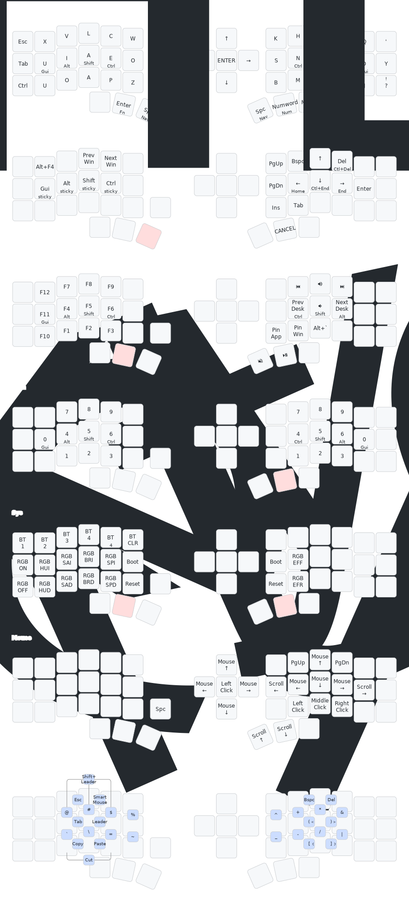

# (Eyelash Peripherals) Corne ZMK Repository

## Keymap Diagram

## Helpful Links
- [ZMK Documentation](https://zmk.dev/docs/)
- [ZMK RodolpheFouquets config](https://github.com/RodolpheFouquet/ergo-keyboard-config)
- [nice-view-mod](https://github.com/dsifry/nice-view-mod)
- [ZMK urobs config](https://github.com/urob/zmk-config)
- [ZMK helpers](https://github.com/urob/zmk-helpers)
